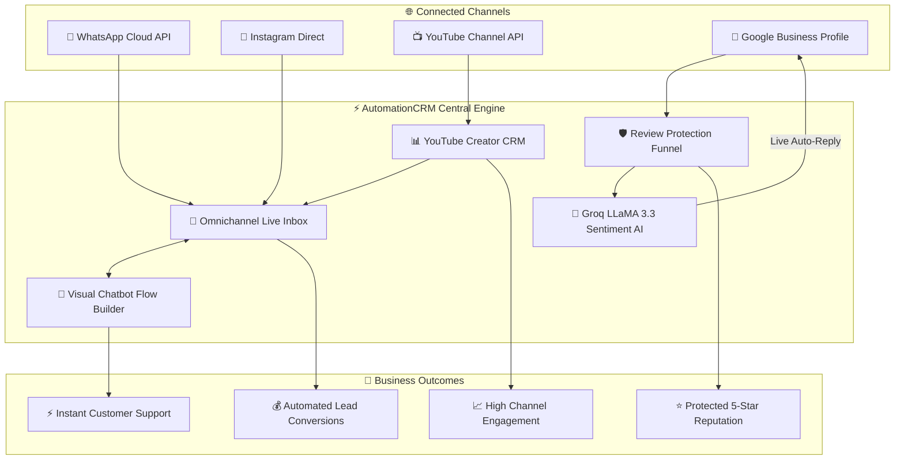
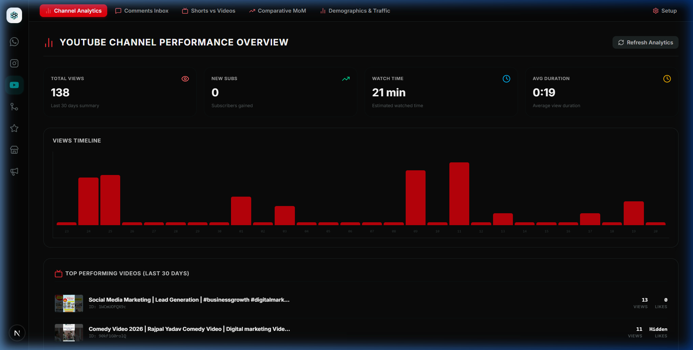
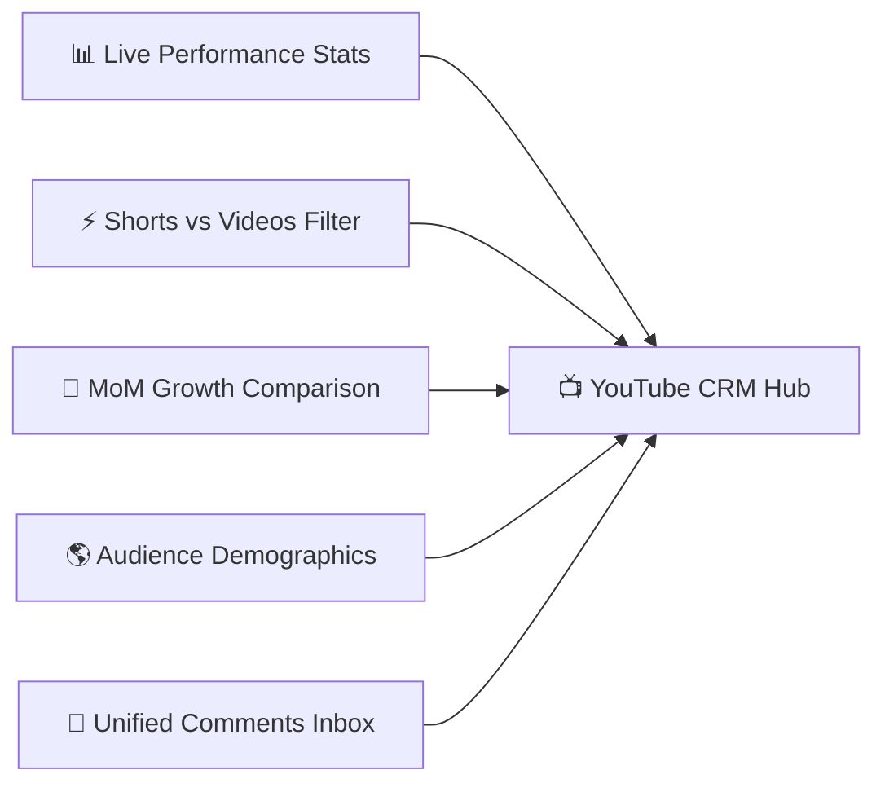
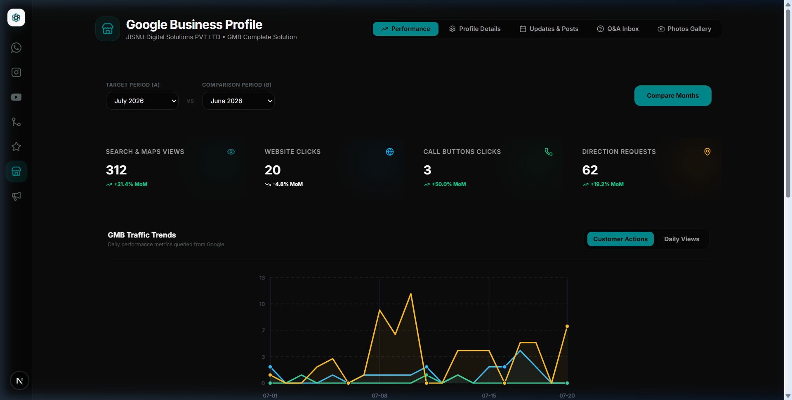
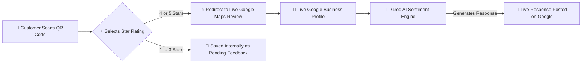
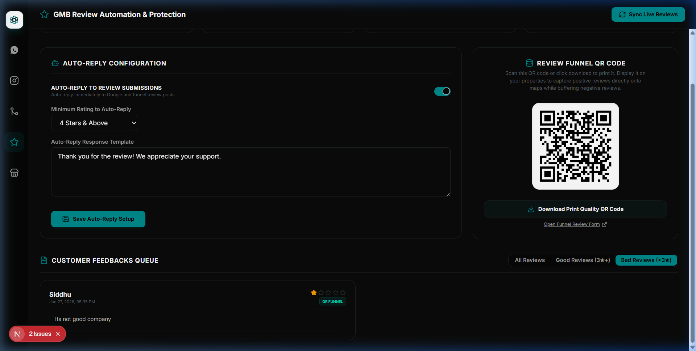
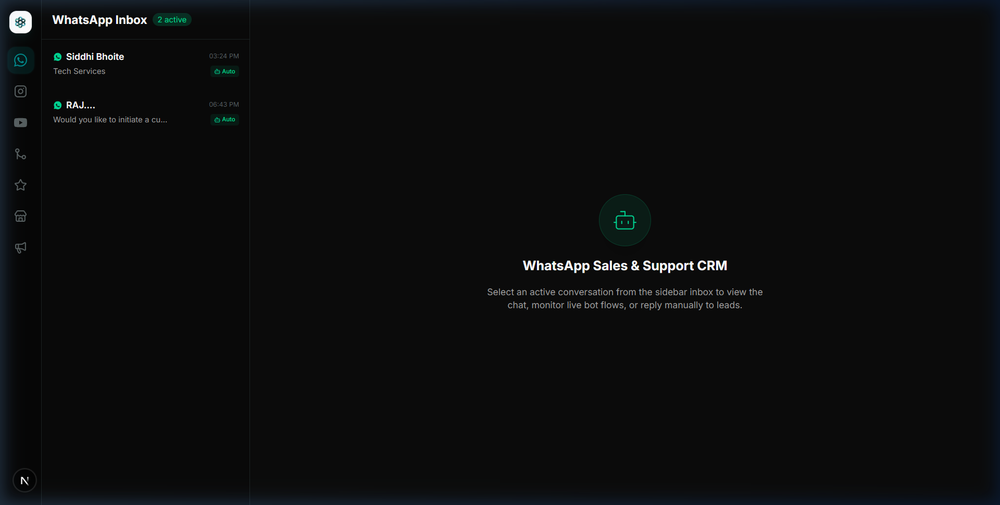
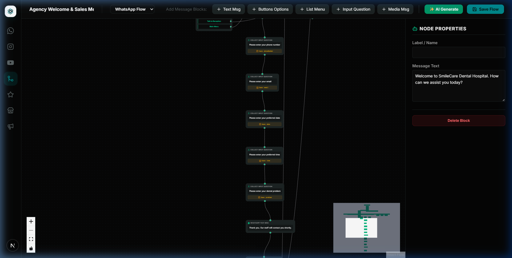
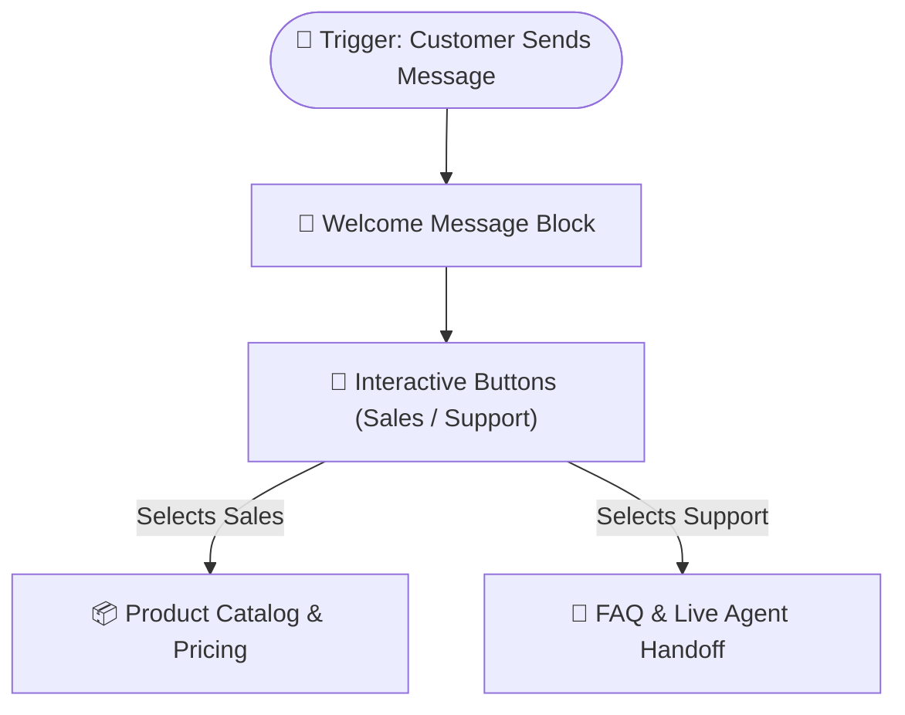
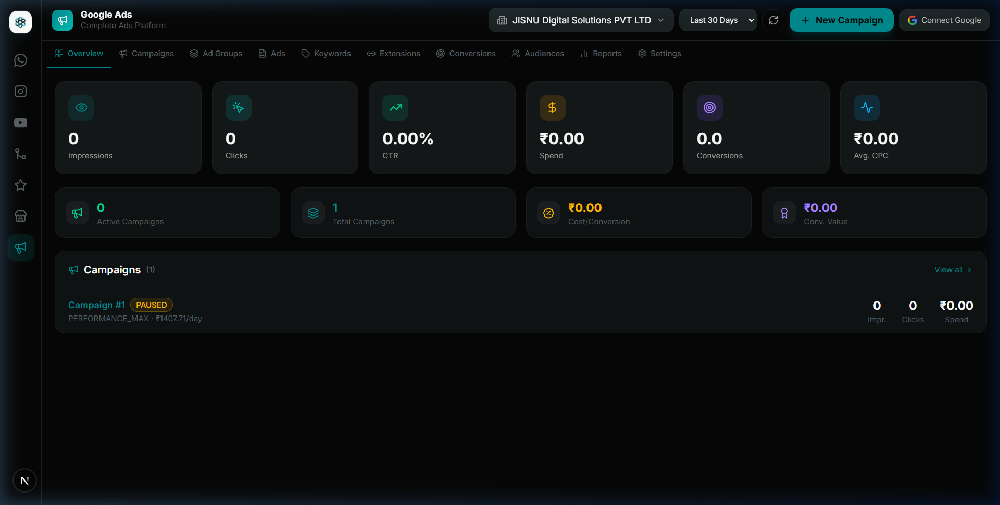

# ⚡ AutomationCRM

> **The Ultimate Omnichannel Customer Engagement, Creator Analytics & AI Marketing Automation Platform**

AutomationCRM is an all-in-one customer relationship and marketing automation suite designed for businesses, agency owners, and digital content creators. It unifies **WhatsApp**, **Instagram DMs**, **YouTube Channel Analytics & Comments**, **Google Business Profiles (GMB)**, **Review Shielding**, and **Google Ads** into a single central dashboard.

---

## 🌟 Executive Overview

In today's digital landscape, businesses lose leads and customer goodwill by managing separate apps for WhatsApp chats, Instagram DMs, YouTube comments, Google Maps reviews, and ad statistics. 

**AutomationCRM** solves this fragmentation by offering:
- 💬 **Unified Omnichannel Inbox**: Handle customer conversations across WhatsApp & Instagram Direct Messages in real time.
- 📺 **Complete YouTube Creator CRM**: Monitor channel growth, compare Shorts vs. Long-form video engagement, analyze audience demographics, and reply to viewer comments.
- 🛡️ **Smart GMB Review Shield**: Buffer negative customer feedback internally while encouraging positive 4-5 star reviews directly onto Google Maps.
- 🤖 **Groq AI-Powered Auto-Replies**: Automatically analyze customer review sentiment using Groq LLaMA 3.3 AI to publish instant, personalized responses on Google Maps.
- 🔀 **Visual Drag-and-Drop Flow Builder**: Build automated chatbot workflows with interactive buttons, menus, and natural language AI flow generation.

---

## 🎨 System Architecture & Customer Journey



---

## 🚀 Key Modules & Visual Feature Guide

### 📺 1. YouTube Creator CRM & Channel Analytics
Built with a signature **YouTube Red theme**, this module empowers creators and agencies to manage their entire YouTube presence without opening multiple browser tabs.





- **Live Channel Metrics**: Real-time tracking of Total Views, Subscribers, Likes, and Watch Time.
- **Shorts vs. Long-Form Classification**: Server-side verification that detects YouTube Shorts from standard videos for accurate engagement rate calculations.
- **Month-over-Month (MoM) Comparative Analytics**: Compare channel growth across custom date ranges (7 Days, 30 Days, 90 Days, 1 Year, Lifetime).
- **Audience Demographics & Traffic Sources**: Insights into viewer age, gender distribution, top viewing countries, device types, and traffic acquisition channels.
- **Unified Comments Inbox**: A responsive card grid displaying all uploaded channel content. Click any video or Short card to open its comment thread and send inline replies directly to viewers.

---

### 🛡️ 2. Google Business Profile & Smart Review Shield
Protect your business reputation while automating customer feedback management on Google Maps.





- **Smart QR Review Funnel**: Generate and print location-specific QR codes. Positive reviews (4-5 stars) are directed to Google Maps, while negative reviews (1-3 stars) are buffered internally for management resolution.
- **Groq AI Sentiment Auto-Reply**: Powered by **Groq LLaMA 3.3 AI**, the system reads customer review text and star ratings to automatically craft and publish empathetic, professional responses:
  - **4-5 Stars**: Generates warm, appreciative customer thank-you messages.
  - **3 Stars**: Generates polite appreciation and commitment to quality improvements.
  - **1-2 Stars**: Generates sincere apologies with direct management contact details.
- **One-Click AI Reply All**: Instantly process all pending unreplied Google reviews using the Groq AI engine.
- **Local Posts Publisher**: Schedule and publish Google local update posts with custom Call-To-Action (CTA) buttons and promotional photos.



---

### 💬 3. Omnichannel Live Messaging Hub
A unified workspace for managing WhatsApp and Instagram Direct conversations.



- **Multi-Platform Support**: Toggle seamlessly between WhatsApp Cloud API and Instagram Direct Messages.
- **Real-Time WebSockets**: Instant message delivery and typing status updates without page refreshes.
- **Quoted Message Replies**: Reply to specific customer text, image, video, or PDF messages with visual quote boxes.
- **Rich Media & Attachments**: Send photos, videos, PDF documents, and audio clips directly in chat threads.

---

### 🤖 4. Visual Drag-and-Drop Chatbot Flow Builder
Build visual automated messaging bots to handle customer inquiries 24/7.





- **Interactive Message Blocks**: Construct flows using Text Blocks, Image/Document Nodes, Interactive Button Blocks, and Dropdown List Menus.
- **AI Prompt-to-Flow Generation**: Type a natural language prompt (e.g., *"Create a real estate inquiry chatbot for WhatsApp"*), and the system automatically generates the node structure and layout.
- **Visual Canvas**: Drag, connect, auto-layout, and test chatbot flows visually.

---

### 📢 5. Google Ads & Campaign Insights
Track ad performance and ROI directly within the CRM.



- **Campaign Health Tracking**: View impressions, clicks, cost-per-click (CPC), and conversion rates.
- **Account Multi-Location Overview**: Link Google Ads accounts to review marketing campaign ROI side-by-side with local GMB traffic.

---

## 🛠️ System Wireframe & Layout Guide

```
+-----------------------------------------------------------------------------------+
|  ⚡ AutomationCRM                                             [ Connected Org v ]  |
+------------------+----------------------------------------------------------------+
|                  |  [ 📊 Analytics ] [ 💬 Comments ] [ ⚡ Shorts/Videos ] [ ⚙️ Setup ] |
|  📌 Navigation   +----------------------------------------------------------------+
|                  |                                                                |
|  💬 WhatsApp     |  +------------------------+  +------------------------------+  |
|  📸 Instagram    |  |  Total Views           |  |  Subscribers Gained          |  |
|  📺 YouTube CRM  |  |  124,500 (+14.2%)      |  |  +1,420 (+8.5%)              |  |
|  📍 Google GMB   |  +------------------------+  +------------------------------+  |
|  ⭐ Reviews      |                                                                |
|  🤖 Flow Builder |  +----------------------------------------------------------+  |
|  📢 Google Ads   |  | 📈 Channel Timeline Performance Chart                    |  |
|  ⚙️ Settings     |  | [ Bar Chart: Views & Engagement Growth ]                 |  |
|                  |  +----------------------------------------------------------+  |
|                  |                                                                |
|                  |  +-----------------------+  +--------------------------------+ |
|                  |  | ⚡ YouTube Shorts Feed|  | 📺 Long-Form Videos Feed       | |
|                  |  | [Shorts Cards Grid]   |  | [Videos Cards Grid]            | |
|                  |  +-----------------------+  +--------------------------------+ |
+------------------+----------------------------------------------------------------+
```

---

## 💡 Key Business Benefits

| Feature | Value & Business Impact |
| :--- | :--- |
| **Unified Omnichannel Inbox** | Reduces customer response times from hours to seconds by consolidating all social messaging channels into one inbox. |
| **Review Shield & Funnel** | Protects online reputation by capturing negative feedback privately while driving 5-star ratings onto Google Maps. |
| **Groq AI Sentiment Replies** | Saves hours of manual work by generating personalized AI responses to customer reviews in seconds. |
| **Creator YouTube Suite** | Gives creators clear visibility into content performance, Shorts analytics, and viewer comments to boost engagement. |
| **24/7 Chatbot Automation** | Automates lead qualification and customer support without increasing headcount. |

---

## 📄 License & Attribution

Distributed under the MIT License. Built with ❤️ for automated customer engagement and creator growth.
